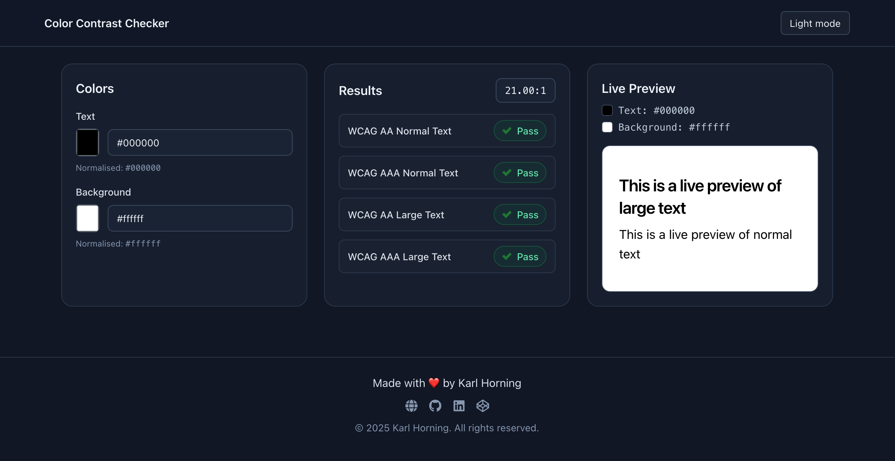

# Color Contrast Checker PWA

---

## Table of Contents

- [Color Contrast Checker PWA](#color-contrast-checker-pwa)
  - [Table of Contents](#table-of-contents)
  - [Overview](#overview)
  - [Screenshots \& Demo](#screenshots--demo)
  - [Tech Stack](#tech-stack)
  - [Installation](#installation)
  - [Scripts \& Usage](#scripts--usage)
  - [Project Structure](#project-structure)
  - [Code Style \& Linting](#code-style--linting)
  - [Live Site or Deployment](#live-site-or-deployment)
  - [Roadmap](#roadmap)
  - [Further Reading \& Resources](#further-reading--resources)
  - [Licence](#licence)
  - [Author](#author)

---

## Overview

An accessible **Progressive Web App (PWA)** to check **colour (color) contrast ratios** for text and backgrounds, ensuring compliance with **WCAG**.

Features include live preview, clear pass/fail badges for AA/AAA (normal/large text), keyboard-friendly controls, and a class-based dark mode.

---

## Screenshots & Demo



Live: <https://www.karlhorning.dev/color-contrast-checker-pwa/>

---

## Tech Stack

- **Framework**: Vite + React 19
- **Languages**: TypeScript
- **Styling**: Tailwind CSS v4 (class-based dark mode)
- **Tooling**: `@tailwindcss/vite`, `vite-plugin-pwa`, ESLint, Prettier, React Icons

---

## Installation

```bash
git clone https://github.com/Karl-Horning/color-contrast-checker-pwa.git
cd color-contrast-checker-pwa
npm install
```

---

## Scripts & Usage

| Command           | Description              |
| ----------------- | ------------------------ |
| `npm run dev`     | Start local development  |
| `npm run build`   | Build for production     |
| `npm run preview` | Preview production build |
| `npm run lint`    | Run ESLint checks        |

---

## Project Structure

```bash
src/
├── components/               # UI components (ColourPicker, ContrastChecker, LivePreview, Header, Footer, etc.)
├── utils/                    # Utilities (e.g. colour/contrast helpers)
├── assets/                   # Icons/images (SVG/PNG) if imported by components
├── App.tsx                   # Root layout (grid of components)
├── main.tsx                  # React entry
└── index.css                 # Tailwind v4 entry + custom variant for dark mode
```

> Tailwind v4 uses the new one-line import:
>
> ```css
> @import "tailwindcss";
> /* Make dark: variants follow the .dark class */
> @custom-variant dark (&:where(.dark, .dark *));
> ```

---

## Code Style & Linting

- ESLint with recommended rules
- Prettier with Tailwind plugin
- Conventional Commits (`feat`, `fix`, `refactor`, `a11y`, etc.)

---

## Live Site or Deployment

Visit the site:
**[Color Contrast Checker PWA](https://www.karlhorning.dev/color-contrast-checker-pwa/)**

---

## Roadmap

- [x] Implement WCAG contrast ratio checking
- [ ] Add offline support (PWA features for usage without internet)
- [ ] Allow saving custom colour palettes
- [ ] Suggest accessible colour combinations based on user input
- [ ] Improve responsive layout and accessibility audits
- [ ] Add sharing/export options for palettes and results

---

## Further Reading & Resources

- [W3C WCAG Contrast Guidelines](https://www.w3.org/WAI/WCAG21/quickref/#contrast-minimum)
- [WebAIM: Contrast Checker](https://webaim.org/resources/contrastchecker/)
- [The Paciello Group: Colour Contrast Analyser](https://www.tpgi.com/color-contrast-checker/)

---

## Licence

MIT © 2025 Karl Horning

---

## Author

Made with ❤️ by [Karl Horning](https://github.com/Karl-Horning)
